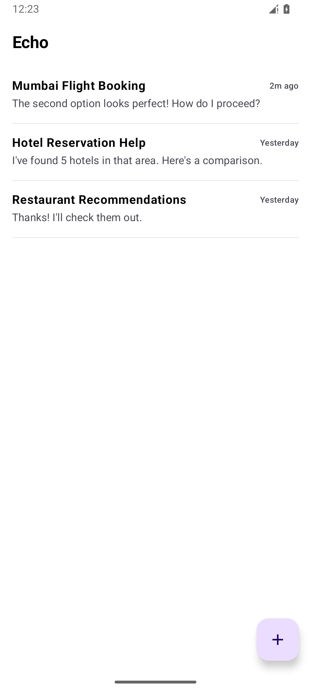
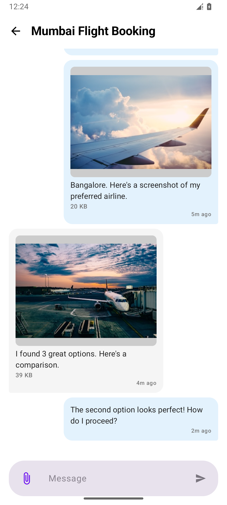
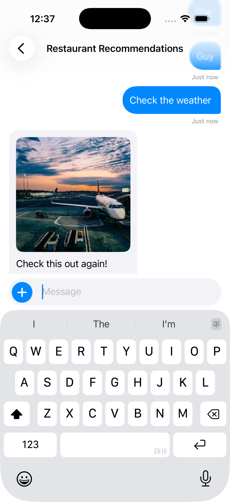
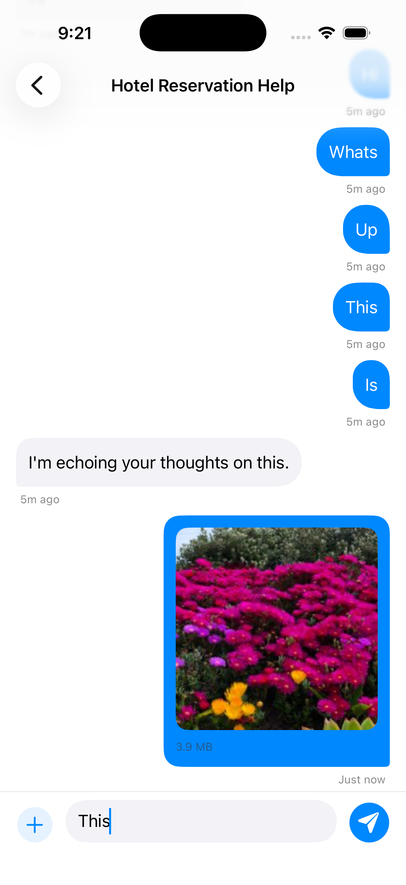
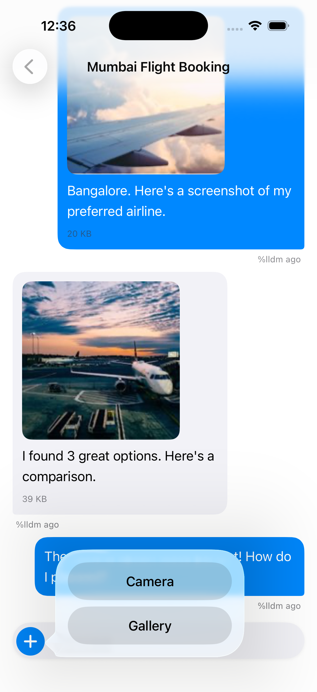

# Echo (KMP)

> [!IMPORTANT]
> **AI Agent Instructions**: If you are an AI agent working on this repository, you **must** read and follow the [AGENTS.md](./AGENTS.md) operating manual before taking any action.

Echo is an **offline-first Kotlin Multiplatform (KMP) chat application** designed to manage multiple conversations between a user and an AI agent. It demonstrates high-quality state management, local data persistence, and platform-native UI performance.

## 🚀 Key Features

- **Offline-First Architecture**: Powered by Room Multiplatform, all chat data is stored locally and loaded instantly.
- **Zero-Network Bootstrap**: Initial data and media assets are pre-bundled and restored locally on the first launch—no internet required.
- **AI Agent Simulation**: Reactive, debounced AI responses with randomized delays and multi-modal (text/image) content.
- **Platform-Native UI**:
    - **Android**: 100% Jetpack Compose with Material3.
    - **iOS**: 100% SwiftUI with native KMP StateFlow observation.

## 📱 Visual Showcase

### Android (Jetpack Compose)
| Home Screen | Chat Detail |
| :---: | :---: |
|  |  |

**[🎥 Watch Android Demo Video](demo/android-video.webm)**

### iOS (SwiftUI)
| Home Screen | Chat Detail | Attachments |
| :---: | :---: | :---: |
|  |  |  |

**[🎥 Watch iOS Demo Video](demo/ios-video.mov)**

## 🏗 Architecture Decisions

This project utilizes **Kotlin Multiplatform (KMP)** to share 100% of the business logic, data persistence, and presentation state across Android and iOS.

- **Offline-First (SSOT)**: We use **Room Multiplatform** as the Single Source of Truth. The UI never interacts with the network directly; it observes the database, ensuring 100% availability in Airplane Mode.
- **Unidirectional Data Flow (UDF)**: Shared ViewModels in `commonMain` expose a single `StateFlow` to the UI, reducing platform-specific bugs and ensuring state consistency.
- **Zero-Network Bootstrap**: A custom `BackupRestoreService` handles the initial data population from a bundled `seed_backup.zip`. This ensures the app is fully functional with rich mock data (3 chats, 20+ messages) immediately after installation, even without an internet connection.
- **Resource Management**: Image thumbnailing is performed locally using platform-native APIs (Coil on Android, UIKit on iOS) but orchestrated via a shared `MediaProcessor` interface.

## 📝 Assumptions

- **Mock AI**: The AI agent is simulated locally. It does not require an API key or internet connection.
- **Initial Data**: The "Seed Data" (3 chats) is restored only once during the first app launch.
- **Media Storage**: All picked or generated images are saved to the app's internal private storage to ensure they are available offline.
- **UUID Generation**: All IDs (`ChatId`, `MessageId`) are generated as version 4 UUIDs to ensure global uniqueness and prevent collisions.
- **UTC Timestamps**: All temporal data is stored as UTC milliseconds and formatted using the device's local system timezone for the UI.
- **Simulated Latency**: AI agent delays (1-2s) are implemented using Coroutine `delay` to simulate network/thinking latency in a realistic manner.

## 🛠 Tech Stack

| Component | Technology |
| :--- | :--- |
| **Language** | Kotlin 2.3.10 |
| **Persistence** | Room Multiplatform 2.8.4 |
| **Preferences** | Jetpack DataStore (Multiplatform) |
| **Dependency Injection** | Koin 4.1.1 |
| **Image Loading** | Coil (Android) / SwiftUI native (iOS) |
| **Concurrency** | Kotlin Coroutines |
| **Build System** | Gradle (Version Catalogs) |

## 📖 Documentation Guide

This repository follows a strict architectural harness. Refer to these documents for deep dives:

1.  **[ARCHITECTURE.md](./ARCHITECTURE.md)**: High-level overview of the layers and design patterns.
2.  **[SYSTEM_DESIGN.md](./SYSTEM_DESIGN.md)**: The technical blueprint, UDF principles, and sequence diagrams.
3.  **[ROADMAP.md](./ROADMAP.md)**: The 7-phase implementation plan and task tracker.
4.  **[AGENTS.md](./AGENTS.md)**: The mandatory operating manual for AI agents.

## 🏁 Setup & Installation

### Android
1. Open the project in **Android Studio** (Ladybug or newer).
2. Sync Project with Gradle Files.
3. Run the `androidApp` configuration on an emulator or physical device.

### iOS
1. Ensure you have **Xcode** installed.
2. Open `iosApp/iosApp.xcworkspace` in Xcode.
3. Select a simulator and run the `iosApp` scheme.

## 🤖 Agentic Workflow

This project is built to be **AI-Native**. A specialized Gemini CLI skill is provided to automate the implementation loop according to the project's architectural standards.

**To install the development skill:**
```bash
gemini skills install ./skills/echo-dev.skill --scope workspace
/skills reload
```

---
Built with ❤️ using Kotlin Multiplatform.
