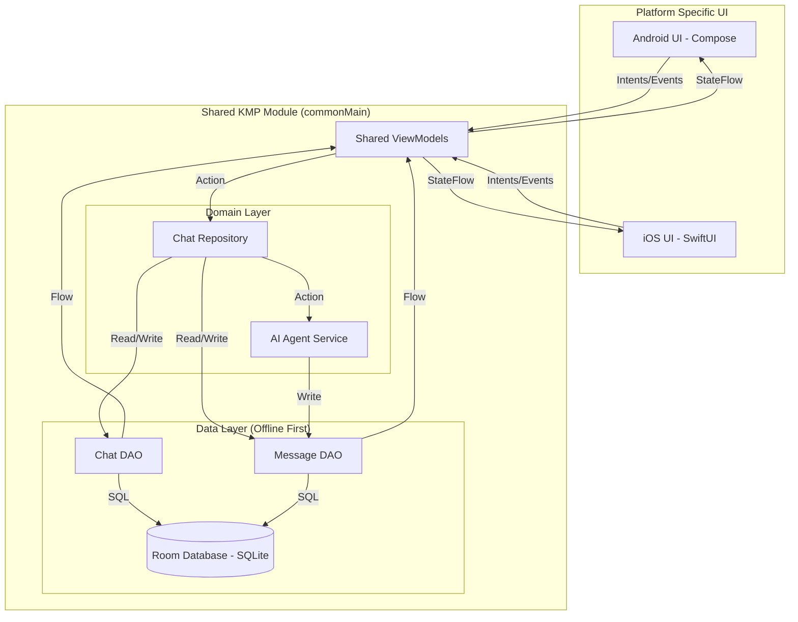
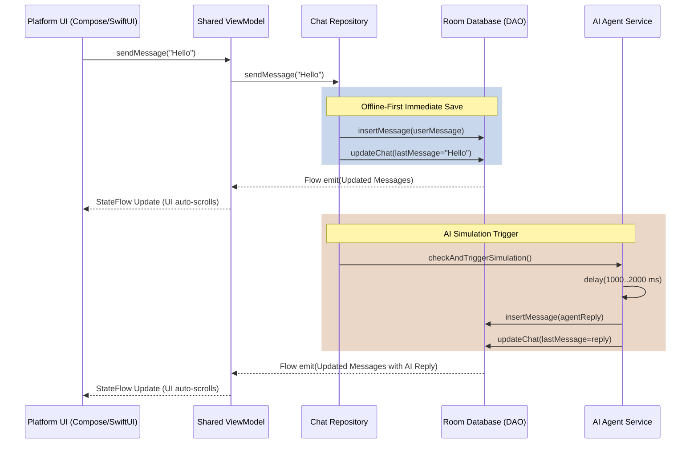

# System Design & Architecture: Echo Chat App

This document serves as the architectural blueprint and system design harness for the Echo Chat App. It dictates how components should be structured and interact across the Kotlin Multiplatform (KMP) project. **All implementation efforts must adhere to these guidelines.**

## 1. High-Level Architecture (KMP Strategy)

The project follows a strict separation of concerns, heavily favoring shared code for business logic and data management, leaving the platform modules purely for UI rendering.

*   **`shared` (commonMain):**
    *   **Data Layer:** Room Multiplatform database, DAOs, Entity definitions.
    *   **Domain Layer:** Core business logic, domain models (mapping from entities if necessary, though direct entity usage is acceptable for this scope), and Repositories.
    *   **Service Layer:** The simulated AI Agent logic (`AgentService` or within `ChatRepository`).
    *   **Presentation Layer (Shared ViewModels):** KMP-compatible ViewModels exposing state (via `StateFlow`) to the UI platforms. *Note: We will use KMP ViewModels to maximize code sharing.*
*   **`androidApp` (Android UI):**
    *   Pure Jetpack Compose UI.
    *   Observes `StateFlow` from shared ViewModels.
    *   Dispatches intents/events to shared ViewModels.
*   **`iosApp` (iOS UI):**
    *   Pure SwiftUI.
    *   Observes state from shared ViewModels (using appropriate KMP wrappers if needed for Swift observation).
    *   Dispatches intents/events to shared ViewModels.

## 2. Core Principles

1.  **Offline-First (Single Source of Truth):**
    *   The Room Database is the *only* source of truth.
    *   The UI **never** holds transient state for lists or chat history. It strictly observes database flows (`Flow<List<Message>>`).
    *   User actions (e.g., sending a message) write directly to the database. The resulting database update triggers the UI re-render automatically via the observed Flow.
2.  **Unidirectional Data Flow (UDF):**
    *   State flows *down* from the Shared ViewModel to the UI.
    *   Events/Intents flow *up* from the UI to the Shared ViewModel.
3.  **Concurrency & Asynchrony:**
    *   All async operations, database transactions, and the AI agent simulation delay must use **Kotlin Coroutines**.
    *   Long-running tasks must not block the main thread.

## 3. Component Design

### 3.1 Data Layer (Room)
*   **Entities:**
    *   `ChatEntity`: Represents a conversation thread.
    *   `MessageEntity`: Represents a single message, tied to a `ChatEntity` via a foreign key/`chatId`.
*   **DAOs:**
    *   `ChatDao`: Operations to fetch chats (sorted by `lastMessageTimestamp`), insert, delete. Exposes `Flow<List<ChatEntity>>`.
    *   `MessageDao`: Operations to fetch messages for a specific chat (sorted chronologically), insert. Exposes `Flow<List<MessageEntity>>`.

### 3.2 Domain / Repository Layer
*   **`ChatRepository`:**
    *   Acts as the mediator between the ViewModels and the DAOs.
    *   Handles complex operations like "Create New Chat" (generating UUID, inserting initial state).
    *   Orchestrates the "Send Message" flow, which includes updating the parent Chat's `lastMessage` and `lastMessageTimestamp`.

### 3.3 AI Agent Service
*   **Responsibility:** Simulates replies based on the rules (every 4-5 messages, 1-2s delay, 70/30 text/image ratio).
*   **Trigger:** Invoked by the `ChatRepository` or `ChatViewModel` *after* a user message is successfully saved to the database.
*   **Implementation:** Must use coroutine `delay()` to simulate thinking. Must track the `userMessageCount` per chat to know when to trigger.

### 3.4 Seed Data & Restore Workflow (`DatabaseSeeder`)
*   **Responsibility:** Simulates a "Restore from Backup" process on the first app launch to populate the database with the required mock data.
*   **Implementation:**
    1.  Reads a `seed_data.json` file bundled in the common resources.
    2.  Parses the JSON into Domain/Entity models using `kotlinx.serialization`.
    3.  Inserts the chats and messages into the Room database.
*   **Asset Handling:** The seed data contains remote URLs for images. To truly support offline-first:
    *   *Ideal Approach:* The seeder could download these images during the "restore" phase, save them to local device storage, and update the database `file.path` to the local `file://` URI.
    *   *Pragmatic Approach (for 3-day timeline):* Store the URLs as-is in the DB, but rely on an image loading library (like Coil/Kamel) configured with aggressive disk caching so they work offline after the first render.

### 3.5 Presentation Layer (Shared ViewModels)
*   **`HomeViewModel`:**
    *   State: `chats: StateFlow<List<Chat>>`
    *   Events: `createChat()`, `deleteChat(id)`
*   **`ChatDetailViewModel`:**
    *   State: `messages: StateFlow<List<Message>>`, `chatDetails: StateFlow<Chat>`
    *   Events: `sendMessage(text, attachment)`, `updateChatTitle(newTitle)`

## 4. Key Workflows

### 4.1 "Send Message" Workflow
1.  **UI Intent:** User taps "Send". UI calls `viewModel.sendMessage(text)`.
2.  **ViewModel:** Validates input, constructs `Message` object (Sender="User").
3.  **Repository:**
    *   Inserts `Message` into Room.
    *   Updates parent `Chat` in Room (`lastMessage` = text, `lastMessageTimestamp` = now).
4.  **UI Update:** Because the UI observes `MessageDao.getMessagesForChat()`, the new message appears immediately.
5.  **AI Trigger:** Repository/ViewModel increments `userMessageCount`. If `count % rand(4,6) == 0`, invokes `AgentService`.
6.  **Agent Logic (Async):**
    *   `delay(1000..2000)`
    *   Decides type (70% text, 30% image) and content.
    *   Inserts Agent `Message` into Room.
    *   Updates parent `Chat` in Room.
7.  **UI Update:** The UI observes the new Agent message and auto-scrolls.

### 4.2 "Create Chat" Workflow
1.  **UI Intent:** User taps "New Chat" on Home Screen.
2.  **ViewModel:** Calls `repository.createNewChat()`.
3.  **Repository:** Generates a new UUID, creates a default `ChatEntity`, and inserts it into Room.
4.  **Navigation:** The UI observes the successful creation (or the updated list) and navigates to the Chat Detail Screen using the new UUID.

## 5. Architectural Diagrams

### 5.1 Component & Data Flow Diagram
This diagram illustrates the Unidirectional Data Flow (UDF) and the strict boundary between the platform UI and the shared KMP core.

### 5.2 "Send Message & AI Reply" Sequence Diagram
This diagram shows the asynchronous flow of sending a message, updating the local database immediately for offline support, and triggering the delayed AI simulation.

