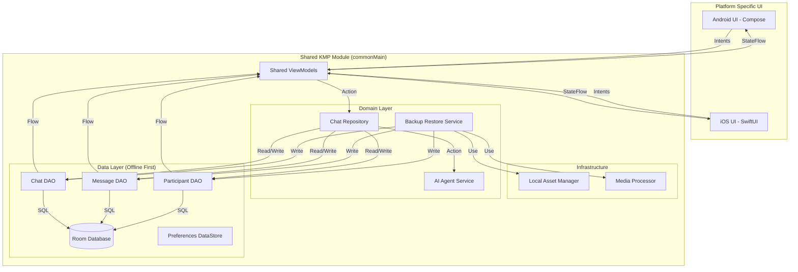
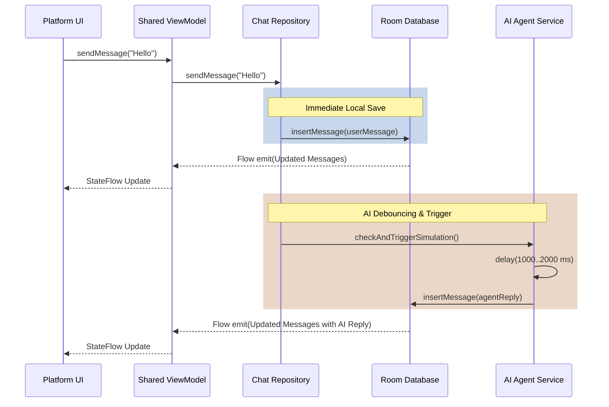

# System Design & Architecture: Echo Chat App

This document serves as the architectural blueprint and system design harness for the Echo Chat App. It dictates how components should be structured and interact across the Kotlin Multiplatform (KMP) project. **All implementation efforts must adhere to these guidelines.**

## 1. High-Level Architecture (KMP Strategy)

The project follows a strict separation of concerns, heavily favoring shared code for business logic and data management, leaving the platform modules purely for UI rendering.

*   **`shared` (commonMain):**
    *   **Data Layer:** Room Multiplatform database, DAOs, **Jetpack DataStore** (for preferences).
    *   **Infrastructure:** **Local Asset Manager** (file I/O) and **Media Processor** (image thumbnailing).
    *   **Domain Layer:** Core business logic, domain models, and Repositories.
    *   **Service Layer:** The simulated AI Agent logic (`AgentService`).
    *   **Presentation Layer (Shared ViewModels):** KMP-compatible ViewModels exposing state (via `StateFlow`) to the UI platforms.
*   **`androidApp` & `iosApp` (Platform UI):**
    *   Pure UI layers (Compose/SwiftUI).
    *   Observe `StateFlow` from shared ViewModels.
    *   Dispatches intents/events to shared ViewModels.
    *   **Splash Logic:** Manages the initial "Restore" vs "Home" routing based on DataStore state.

## 2. Core Principles

1.  **Offline-First (Single Source of Truth):**
    *   The Room Database is the *only* source of truth for chat data.
    *   The UI strictly observes database flows (`Flow<List<Message>>`).
    *   User actions write directly to the database. The resulting database update triggers the UI re-render.
2.  **Zero-Network Bootstrap:**
    *   Initial data is restored from pre-bundled assets.
    *   The app requires zero internet access for its core functionality and initial setup.
3.  **Unidirectional Data Flow (UDF):**
    *   State flows *down* from the Shared ViewModel to the UI.
    *   Events/Intents flow *up* from the UI to the Shared ViewModel.
4.  **Concurrency & Asynchrony:**
    *   All async operations use **Kotlin Coroutines**.

## 3. Component Design

### 3.1 Data Layer (Room & DataStore)
*   **Room Entities:** `ChatEntity`, `MessageEntity`, `ParticipantEntity`, `ChatParticipantCrossRef`.
*   **Relations:** `ChatWithParticipants`, `MessageWithSender`.
*   **DataStore:** Tracks application metadata (e.g., `isRestoreCompleted`).

### 3.2 Infrastructure
*   **`LocalAssetManager`**: Manages internal app storage file operations (using Okio). It provides URI-safe path resolution, ensuring that platform-specific URIs (e.g., `content://`, `file://`) and remote URLs are returned as-is, while local relative paths are resolved to absolute platform paths.
*   **`MediaProcessor`:** Handles image downsizing and thumbnail generation to ensure high-performance list rendering and disk efficiency.

### 3.3 Domain / Repository Layer
*   **`ChatRepository`:**
    *   Mediates between ViewModels and the Data Layer.
    *   Orchestrates the "Send Message" and "Create Chat" workflows.
*   **`BackupRestoreService`:**
    *   Coordinates the one-time restoration of bundled JSON data and physical image assets.

### 3.4 AI Agent Service
*   **Responsibility:** Simulates replies (70% text, 30% image) with a 1-2s delay.
*   **Simulation Rules:**
    *   **Trigger:** Every 4-5 user messages.
    *   **Debounce:** The service must debounce rapid user inputs to prevent multiple concurrent "thinking" states.
    *   **Persistence:** Agent replies are saved directly to Room, triggering UI updates.

### 3.5 Presentation Layer (Shared ViewModels)
*   **`HomeViewModel`:** Manages the chat list and global app state.
*   **`ChatDetailViewModel`:** Manages message history and input states.

## 4. Key Workflows

### 4.1 "Send Message & AI Reply" Workflow
1.  **UI Intent:** User sends message.
2.  **Repository:** Saves User Message to Room -> Room triggers UI update.
3.  **Agent Trigger:** Repository checks message count and debounces.
4.  **Agent Simulation:** After 1-2s delay, Agent generates reply.
5.  **Agent Persistence:** Agent reply saved to Room -> Room triggers UI update.

### 4.2 "New Chat" Workflow (AI-Centric)
1.  **Intent**: User triggers "New Chat" (Gemini/ChatGPT style).
2.  **Navigation**: Platform UI navigates to a blank `ChatDetail` screen with a temporary session ID.
3.  **Initialization**: Upon the first user message:
    *   `ChatDetailViewModel` calls `ChatRepository.createChat` using the message preview as the title.
    *   The message is saved atomically within the same transaction.
4.  **Simulation**: Standard AI simulation logic triggers.

### 4.3 "Initial Restore" Workflow
1.  **App Launch:** Platform Splash Screen checks DataStore.
2.  **Restore Engine:** If `isRestoreCompleted` is false, reads bundled JSON and copies/processes bundled images.
3.  **Completion:** Updates DataStore and routes user to the Home Screen.

## 5. Architectural Diagrams

### 5.1 Component & Data Flow Diagram

### 5.2 "Send Message & AI Reply" Sequence Diagram

## 6. Zero-Network Bootstrap & Backup Structure

To fulfill the "Offline-First" requirement from the very first launch, the application includes a robust **Zero-Network Bootstrap** mechanism. This allows the app to populate a rich set of initial data without any internet connection.

### 6.1 Backup Bundle Components
The bootstrap data is stored in the application's assets (e.g., `androidApp/src/main/assets` and the iOS App Bundle) as a compressed `seed_backup.zip`:

*   **`data.json`**: Contains the full normalized schema for initial Chats, Participants, and Messages.
*   **`media/` folder**: Contains physical high-resolution image assets referenced in the JSON.

### 6.2 Restoration Process
Upon the first launch, the `BackupRestoreService` performs the following atomic operations:

1.  **JSON Parsing**: Reads and validates the `data.json` into Room Entities.
2.  **Asset Extraction**: Unzips the physical image assets into the app's internal private storage.
3.  **Media Processing**: Triggers the `MediaProcessor` to generate local thumbnails for every restored image, ensuring immediate, smooth list rendering.
4.  **Transaction Finalization**: Once all entities and files are persisted, it updates the **Jetpack DataStore** flag (`isRestoreCompleted = true`).

### 6.3 Recovery Logic
If the restoration process is interrupted (e.g., app crash), the system uses the DataStore flag to resume or restart the restoration on the next launch, ensuring the database never enters an inconsistent state.

